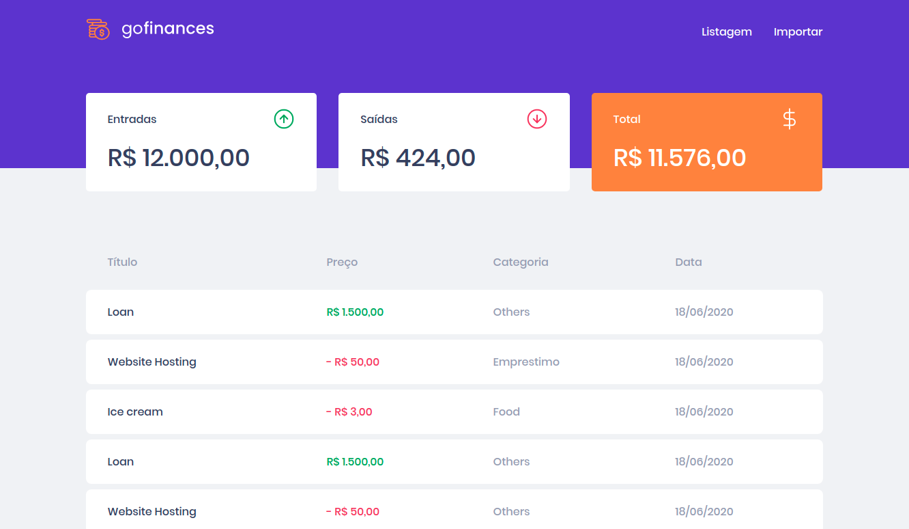
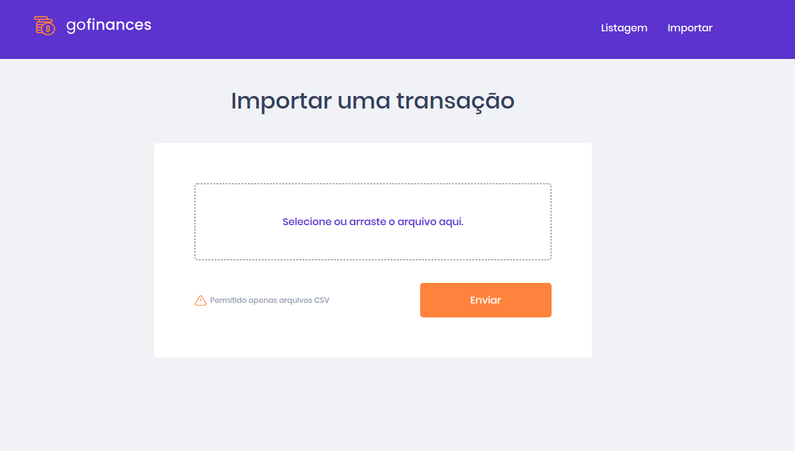

# Go Finances

> Versão WEB da aplicação GoFinances, desenvolvida com TypeScript.
> Aplicação Consiste em controlar entrada e saida de gastos, organizando por categorias, e gerando um balanço geral.


<span>
Para rodar a aplicação, de 1 Fork nesse Repositório
</span>

</br>
<span>
Apos o Fork rode os comandos para Instalar os Repositórios:</span>

```js
yarn
```


>Tenha em mente que você precisara ter a API rodando na porta 3333

[Link da API](https://github.com/fernandof23/GoFinances_Api)

Para rodar a aplicação, e para rodar os testes segue os comandos:

```js
yarn start // para iniciar o servidor

yarn test //para rodar os testes

```


Exemplo de arquivo CSV que pode ser enviado na aba de Import CSV:

```js
title, type, value, category
Loan, income,1500, Others
Website Hosting, outcome,50,Emprestimo
Ice cream, outcome,3, Food
Loan, income,1500, Others
Website Hosting, outcome,50, Others
Ice cream, outcome,3, Food
Loan, income,1500,Carro
Website Hosting, outcome,50, Others
Ice cream, outcome,3, Food
Loan, income,1500, Others
Website Hosting, outcome,50,Escola
Ice cream, outcome,3, Food

```

[CsvExemplo](https://github.com/Rocketseat/bootcamp-gostack-desafios/blob/master/desafio-database-upload/assets/file.csv)


Nessa aplicação foram usada as tecnologias:

- ReactJs
- Styled-Components
- TypeScript
- entre outros


>Segue Imagens da aplicação:

- Dashboard



- Import




### Aplicação desenvolvida por [Fernando Santos](https://www.linkedin.com/in/fernando-santos-686632122/) durante o bootcamp da [RocketSeat](https://rocketseat.com.br/).
